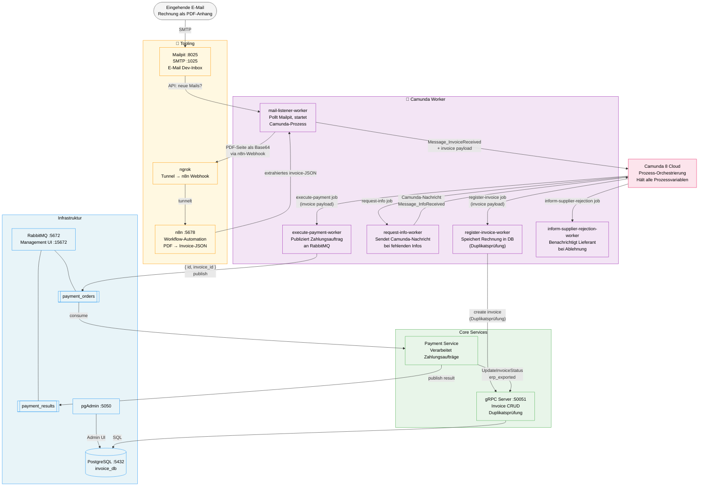

# Rechnungsbearbeitung – Camunda 8 Workflow-System

Dieses Projekt implementiert einen vollständigen, automatisierten **Rechnungsbearbeitungsprozess** auf Basis von **Camunda 8**. Eine eingehende Rechnung (per E-Mail als PDF) durchläuft dabei einen orchestrierten Workflow: vom automatischen Einlesen über Validierung, Genehmigung und Duplikatsprüfung bis hin zur Zahlungsauslösung und ERP-Statusaktualisierung.

Camunda fungiert dabei als zentraler **Dirigent** – alle Prozessvariablen und der Rechnungs-Payload werden in Camunda gehalten und von dort an die jeweiligen Worker und externen Systeme (UiPath/ERP) weitergegeben. Die lokale Datenbank dient ausschließlich als schlanker **Metadaten-Index** für Duplikatsprüfung und Status-Dashboard.

---

## Architektur



---

## Komponenten

### Infrastruktur

- **PostgreSQL** — Relationale Datenbank (`invoice_db`). Speichert einen schlanken Metadaten-Index der Rechnungen (ID, Lieferant, Bruttobetrag, Status) für Duplikatsprüfung und Status-Dashboard. Kein schwerer ERP-Payload – dieser liegt in Camunda.
- **RabbitMQ** — Message Broker mit zwei Queues: `payment_orders` (Worker → Payment Service) und `payment_results` (Payment Service → Ergebnis-Log).
- **pgAdmin** — Web-UI zur Administration der PostgreSQL-Datenbank (`:5050`).

### Tooling

- **Mailpit** — Lokale E-Mail-Dev-Inbox (SMTP `:1025`, Web-UI `:8025`). Fängt eingehende Rechnungs-E-Mails ab.
- **n8n** — Low-Code Workflow-Automation. Empfängt PDF-Bilder vom Mail-Listener per Webhook, extrahiert mittels KI die Rechnungsdaten und gibt ein strukturiertes `invoice`-JSON zurück.
- **ngrok** — Tunnelt den n8n-Webhook-Endpunkt ins lokale Netzwerk, damit der Worker den n8n-Container von außen erreichbar macht.

### Core Services

- **gRPC Server** (`grpc_service/`) — Implementiert CRUD-Operationen auf der Invoice-DB über ein Protobuf-definiertes Interface (Port `:50051`). Wird vom `register-invoice-worker` für Duplikatsprüfung und vom Payment Service für Status-Updates genutzt.
- **Payment Service** (`payment_service/`) — Konsumiert Zahlungsaufträge aus der `payment_orders`-Queue, simuliert die Zahlungsverarbeitung und ruft anschließend via gRPC `UpdateInvoiceStatus("erp_exported")` auf. Veröffentlicht das Ergebnis in `payment_results`.

### Camunda Worker

- **mail-listener-worker** — Pollt regelmäßig die Mailpit-API auf neue E-Mails. Extrahiert PDF-Anhänge, wandelt die erste Seite in ein Base64-Bild um, sendet es an den n8n-Webhook zur KI-Extraktion, und startet mit dem zurückgegebenen `invoice`-JSON den Camunda-Prozess via `Message_InvoiceReceived`.
- **register-invoice-worker** — Empfängt das `invoice`-Objekt von Camunda, prüft auf Duplikate (via gRPC) und speichert die Rechnung als Metadaten-Eintrag in der DB (`status: pending`).
- **request-info-worker** — Wird aufgerufen, wenn im Prozess Rückfragen beim Lieferanten notwendig sind. Sendet eine Camunda-Korrelationsnachricht (`Message_InfoReceived`), sobald die Antwort vorliegt.
- **execute-payment-worker** — Liest `invoiceID` aus dem `invoice`-Objekt und publiziert einen schlanken Zahlungsauftrag `{ id, invoice_id, payment_method, … }` in die `payment_orders`-Queue. Kein gRPC-Aufruf – der komplette Invoice-Payload bleibt in Camunda.
- **inform-supplier-rejection-worker** — Sendet im Ablehnungsfall eine Benachrichtigung an den Lieferanten.

---

## Container Setup

### 1. Repository klonen und in Verzeichnis wechseln

```bash
cd rechnungsbearbeitung
```

### 2. Alles bauen und starten

```bash
docker compose up -d --build
```

Dies baut alle Container, synchronisiert Dependencies mit `uv`, und startet alle Services sowie Worker.

### 3. Status der Container prüfen

```bash
docker compose ps
docker compose logs -f
```

### 4. RabbitMQ UI

```text
http://localhost:15672
user: guest
pass: guest
```

### 5. pgAdmin für PostgreSQL

```text
http://localhost:5050
email: admin@example.com
pass: admin123
```

Nach dem Login den PostgreSQL-Server manuell anlegen:

- Host: `postgres`
- Port: `5432`
- Maintenance DB: `invoice_db`
- User: `invoice_user`
- Password: `invoice_password`

### 6. Postgres prüfen

```bash
docker compose exec postgres psql -U invoice_user -d invoice_db -c "\dt"
docker compose exec postgres psql -U invoice_user -d invoice_db -c "select * from invoices;"
```

Hinweis: Die Tabelle `invoices` wird vom gRPC Service beim Start automatisch angelegt (SQLAlchemy `create_all`).

---

## Befehls-Referenz

### Docker Compose

```bash
# Alles bauen und starten
docker compose up -d --build

# Logs anschauen (alle Services)
docker compose logs -f

# Container anhalten (Daten bleiben)
docker compose down

# Komplett reset inkl. DB Daten
docker compose down -v

# Status prüfen
docker compose ps

# In einen Container gehen
docker compose exec postgres psql -U invoice_user -d invoice_db

# Build-Fehler debuggen
docker compose build --no-cache
```

### `uv` (lokale Entwicklung)

```bash
# Dependencies synchronisieren
uv sync

# gRPC Stubs neu generieren (nach .proto Änderungen)
./generate_grpc.sh

# Syntax-Check für generate_grpc.sh
bash -n generate_grpc.sh
```

### PostgreSQL / Database

```bash
# In der postgres Container Logs anschauen
docker compose logs postgres

# SQL-Befehle ausführen
docker compose exec postgres psql -U invoice_user -d invoice_db -c "SELECT * FROM invoices;"

# Tabellen-Schema anschauen
docker compose exec postgres psql -U invoice_user -d invoice_db -c "\dt"
docker compose exec postgres psql -U invoice_user -d invoice_db -c "\d invoices"
```

### Sonstige

```bash
# pgAdmin Web UI öffnen
# http://localhost:5050

# RabbitMQ Web UI öffnen
# http://localhost:15672 (guest / guest)

# Netzwerk prüfen
docker network ls
docker network inspect rechnungsbearbeitung_default

# Image-Größe prüfen
docker images | grep rechnungsbearbeitung
```
